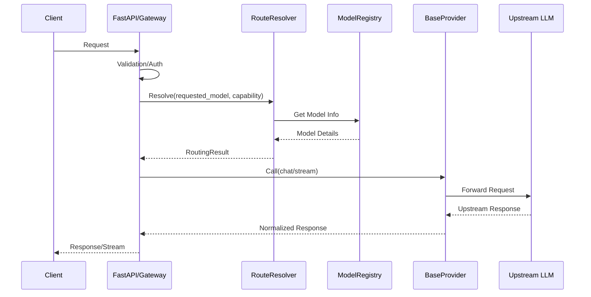
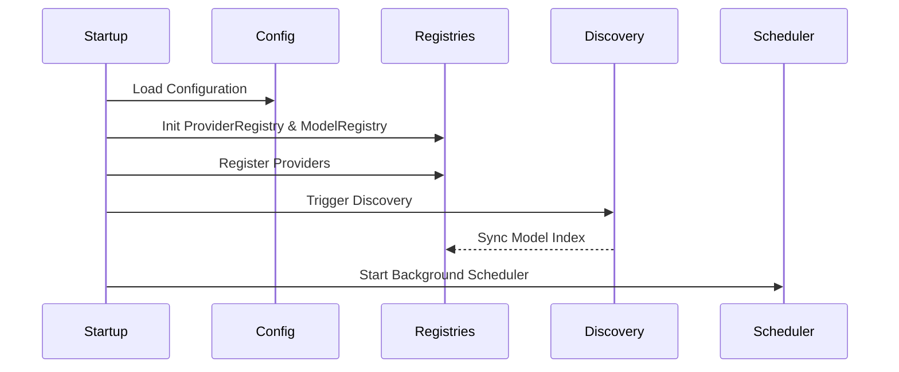
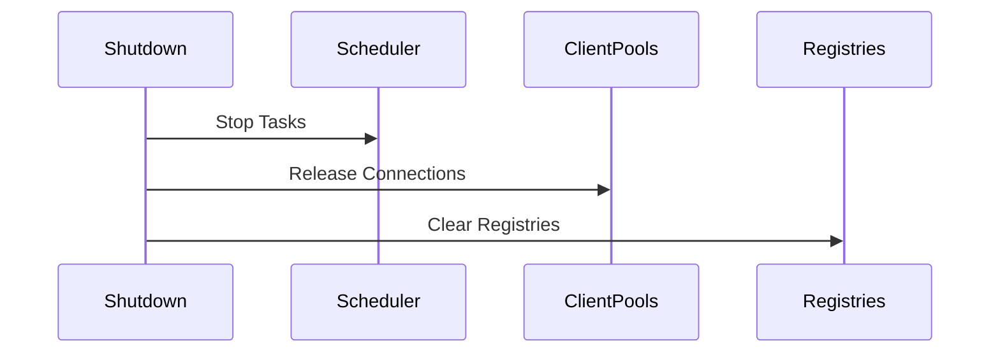
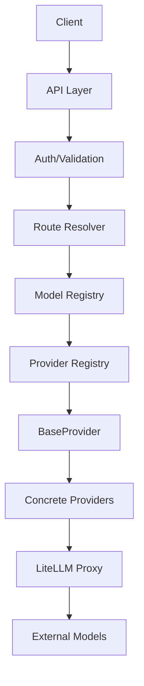

# ADR-001: Gateway Architecture

## 1. Goals
The Nexus AI Gateway provides a robust interface for multi-provider AI access:
- **Provider Agnostic:** Abstract underlying providers via a unified interface.
- **OpenAI/Anthropic Compatible:** Native interface support for common API standards.
- **Dynamic Model Discovery:** Automatic normalization of model metadata.
- **Intelligent Routing:** Deterministic capability-aware selection.
- **Streaming Support:** First-class handling for real-time model output.
- **High Availability:** Health-aware selection and failover.
- **Extensibility:** Simple plugin architecture for new providers.

## 2. Non-Goals
- Implementing underlying model logic or fine-tuning.
- Complex persistent state management outside of the registry.
- Acting as the primary Authentication Authority (delegated to middleware).

## 3. Complete Request Flow

## 4. Startup Flow

## 5. Shutdown Flow

## 6. Multi-Provider Routing Strategy
Routing involves candidate model generation, ranking, and potential fallback:
1. **Capability filtering:** Identify models meeting requirements.
2. **Health filtering:** Exclude unhealthy providers/models.
3. **Priority ranking:** Rank based on provider-defined priority.
4. **Candidate list:** Ordered list of candidates.
5. **Execution:** Attempt first candidate.
6. **Fallback:** If execution fails, automatically attempt next in candidate list.

## 7. Provider Lifecycle States
- **REGISTERED:** Initial state.
- **DISCOVERING:** Loading models.
- **HEALTHY:** Ready for requests.
- **DEGRADED:** High latency/error rate.
- **UNHEALTHY:** Failed health checks.
- **DISABLED:** Manually toggled off.

## 8. Model Lifecycle States
- **DISCOVERED:** Metadata parsed.
- **AVAILABLE:** Verified ready.
- **DEGRADED:** Performance issues.
- **UNAVAILABLE:** Discovery failure.
- **DEPRECATED:** No longer supported.

## 9. Retry and Failure Policy
- **Retryable:** Timeouts, 5xx errors, rate limits (exponential backoff).
- **Non-Retryable:** 4xx auth failures, invalid requests, unsupported capabilities.
- **Failover:** Move to next provider in candidate list.

## 10. Streaming Architecture
Request -> FastAPI -> RouteResolver -> BaseProvider -> Async Stream -> Response Normalization -> SSE/chunked response -> Client.
- Supports cancellation handling.
- Normalizes chunk events.

## 11. Provider Plugin Architecture
1. Implement `BaseProvider`.
2. Add provider module.
3. Register in `main.py` lifespan.
4. Discovery updates Registry.
5. Router includes in candidate list.

## 12. Configuration Philosophy
- Environment-driven (via `pydantic-settings`).
- Secrets managed securely.
- Immutable startup configuration.
- Runtime state encapsulated in registries.

## 13. API Compatibility Policy
- Support for OpenAI/Anthropic standards.
- Strict backward compatibility.
- Breaking changes require versioned API endpoints.

## 14. Final Architecture Diagram

## 15. Summary of Architecture
- **Responsibilities:** Registry (truth), Discovery (normalization), Provider (interface), Routing (selection).
- **Dependencies:** Loosely coupled via interfaces (`BaseProvider`).
- **Failure Handling:** Centralized through normalization and fallback strategies.
- **Extension:** Pluggable provider architecture.

## 16. Risks
- **Coupling:** Strict interface enforcement.
- **Complexity:** Modular registry maintenance.
- **Performance:** In-memory index lookups.
