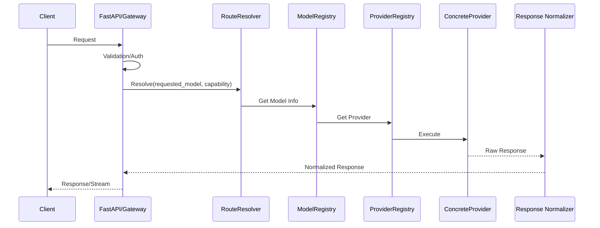
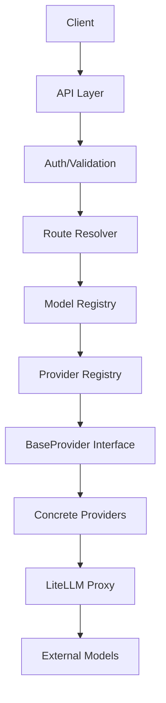

# ADR-001: Gateway Architecture

## 1. Goals
- **Provider Agnostic:** Abstract underlying providers via a unified interface.
- **OpenAI/Anthropic Compatible:** Native interface support for common API standards.
- **Dynamic Model Discovery:** Automatic normalization of model metadata.
- **Intelligent Routing:** Deterministic capability-aware selection.
- **Streaming Support:** First-class handling for real-time model output.
- **High Availability:** Health-aware selection and failover.
- **Extensibility:** Simple plugin architecture for new providers.

## 2. Request Flow

## 3. Registry Lookup Complexity
- **Exact model lookup:** $O(1)$
- **Indexed lookups:** $O(k)$ (where k = number of matching records)

## 4. Provider Plugin Architecture
The registry layer acts as the centralized authority for providers. Adding a new provider is decoupled from core infrastructure:
1. Implement `BaseProvider`.
2. Add provider implementation.
3. Register via the centralized registration layer (e.g., `ProviderRegistry`).
4. `DiscoveryManager` automatically discovers models from registered providers.
5. `ModelRegistry` indexes capabilities for `RouteResolver` consideration.

## 5. Data Ownership
- **Configuration:** Immutable startup settings (`pydantic-settings`).
- **Provider instances:** Owned by `ProviderRegistry`.
- **Model metadata:** Owned by `ModelRegistry`.
- **Discovery state:** Owned by `DiscoveryManager`.
- **Routing decisions:** Ephemeral (per-request).
- **Runtime metrics:** Aggregated by metrics middleware/collectors.

## 6. Architecture Diagram

