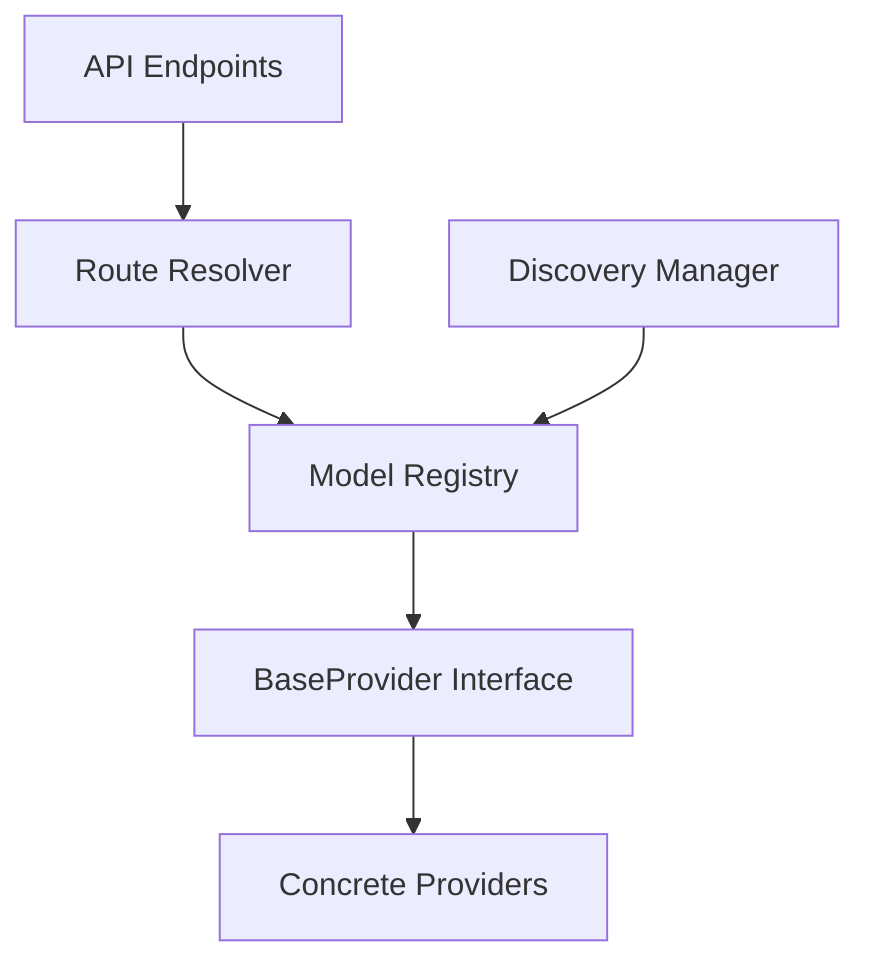
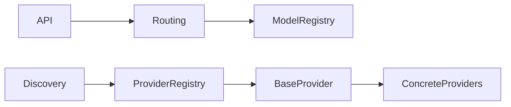

# ADR-001: Gateway Architecture

## Context
The Nexus AI Gateway requires a modular, provider-agnostic architecture to support intelligent AI model routing and dynamic discovery.

## Decision
We have adopted a decoupled, dependency-inversion-based architecture.

## Component Diagram

## Dependency Graph

## Startup Sequence
1. FastAPI app initializes `lifespan`.
2. `ProviderRegistry` and `ModelRegistry` initialized.
3. Providers registered in `ProviderRegistry`.
4. `DiscoveryManager` queries registries, runs health checks, populates registries.

## Request Flow
1. API receives request.
2. `RouteResolver` queried for model/capability.
3. `RouteResolver` returns `RoutingResult`.
4. Gateway interacts with `BaseProvider` to execute.

## Component Responsibilities
- **Registry:** Single source of truth for providers and models.
- **Discovery:** Normalizes provider metadata and populates registry.
- **Provider:** Abstract interface for model interaction.
- **Routing:** Deterministic selection of provider and model.

## Design Principles
- **Decoupling:** Components interact via interfaces.
- **Dependency Inversion:** Higher-level modules depend on abstractions.
- **Extensibility:** New providers are added via `BaseProvider` implementation.

## Future Provider Integration Guide
1. Implement `BaseProvider` interface.
2. Add provider to `app/providers/`.
3. Register provider in `main.py` lifespan.
