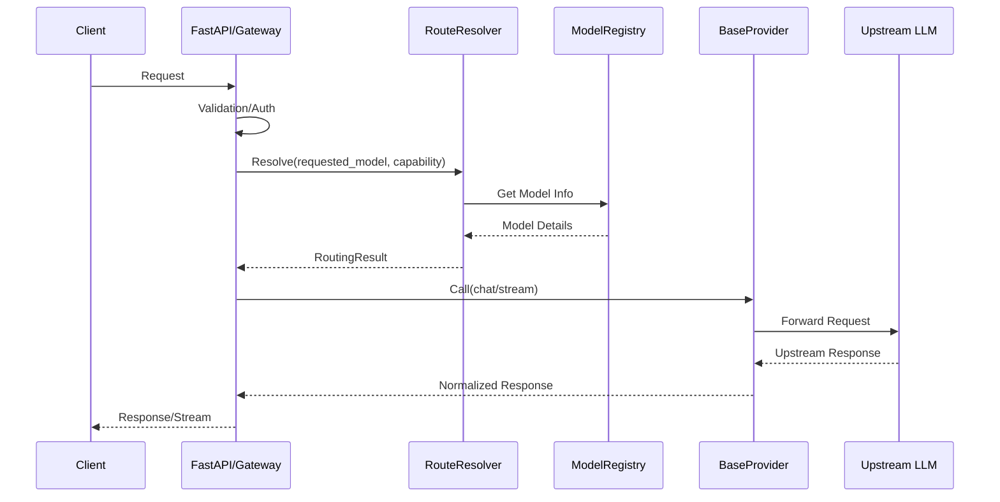
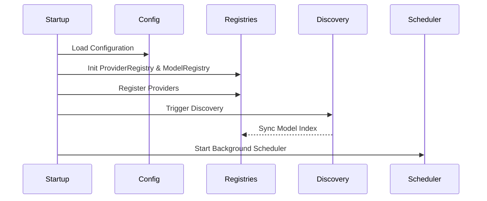

# ADR-001: Gateway Architecture

## 1. Goals
The Nexus AI Gateway provides a robust interface for multi-provider AI access:
- **Provider Agnostic:** Abstract underlying providers via a unified interface.
- **OpenAI/Anthropic Compatible:** Native interface support for common API standards.
- **Dynamic Model Discovery:** Automatic normalization of model metadata.
- **Intelligent Routing:** Deterministic capability-aware selection.
- **Streaming Support:** First-class handling for real-time model output.
- **High Availability:** Health-aware selection and failover.
- **Extensibility:** Simple plugin architecture for new providers.

## 2. Non-Goals
- Implementing underlying model logic or fine-tuning.
- Complex persistent state management outside of the registry.
- Acting as the primary Authentication Authority (delegated to middleware).

## 3. Complete Request Flow

## 4. Startup Flow

## 5. Shutdown Flow
1. Scheduler stops all background tasks.
2. HTTP clients (connection pools) released.
3. Cache connections closed.
4. `ProviderRegistry` and `ModelRegistry` cleared.

## 6. Routing Strategy
- **Exact Model Routing:** Highest priority; uses ID lookup.
- **Capability Routing:** Used if exact model is missing or unhealthy; filters models supporting the requested capability.
- **Fallback Routing:** If preferred model/provider fails, automatically selects the next healthy compatible model.
- **Future:** Cost and latency-aware routing metrics will be implemented.

## 7. Registry Design
- **Indices:** `ProviderRegistry` and `ModelRegistry` maintain indices by `provider`, `capability`, and `modality`.
- **Thread/Async Safety:** Uses `asyncio.Lock` for all mutations.
- **Complexity:** $O(1)$ for exact match, $O(N)$ for category lookups.

## 8. Provider Contract (`BaseProvider`)
Mandatory implementation of:
- `health()`, `list_models()`
- `chat()`, `stream_chat()`
- `embeddings()` (optional)
- `supports()`, `get_capabilities()`

## 9. Error Handling Strategy
- Catch `httpx` and provider-specific exceptions.
- Normalize into internal `GatewayException` hierarchy.
- Ensure secrets are sanitized before logging.

## 10. Observability
- **Logging:** Structured JSON logs via `structlog`.
- **Metrics:** Prometheus-compatible counters for latency, request count, and failures.
- **Health:** `/health` endpoint for uptime monitoring.

## 11. Security
- API keys retrieved from secure environment via `pydantic-settings`.
- Sensitive data filtering in logs.
- Rate limiting to be implemented as FastAPI middleware.

## 12. Testing Strategy
- **Unit:** Individual component verification (Registry, Resolver).
- **Integration:** Provider-specific interface compliance.
- **End-to-End:** Full request flow validation with mocked upstreams.
- **Performance:** Load testing of resolver logic.

## 13. Future Roadmap
- OpenAI/Anthropic native API compatibility.
- Circuit breakers for unhealthy providers.
- Cost-aware routing.
- Caching layer for model responses.

## 14. Risks
- **Provider Coupling:** Mitigation: Strict `BaseProvider` enforcement.
- **Complexity:** Mitigation: Maintain modular registries.
- **Performance:** Mitigation: Keep registry lookups in-memory/O(1) where possible.
